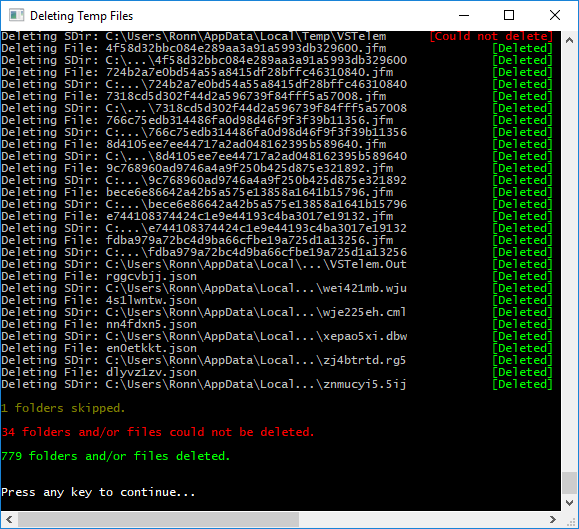

# DeleteTempFiles

<<<<<<< .mine
This MS Windows mini-application is used for automatically deleting all folders and/or files from both
the user's designated `%TEMP%` folder (e.g. `'%USERPROFILE%\AppData\Local\Temp'`) and
the `'Temp'` folder located in the `'Windows'` directory (e.g. `'%WINDIR%\Temp'`).
=======
This MS Windows mini-application is used for automatically deleting all folders and/or files from both
the user's designated `%TEMP%` folder (e.g. `'C:\Users\[Username]\AppData\Local\Temp'`) and
the `'Temp'` folder located in the `'Windows'` directory (e.g. `'C:\Windows\Temp'`).
>>>>>>> .theirs

### Options

If you want to specify that certain files or folders should be excluded, i.e., **NOT** be deleted, 
you can pass in a **comma-delimited** list of files and/or folders as an argument to the executable
by using a shortcut to this application or by running it directly from the Windows command-line.

For example:

    "%ProgramFiles(x86)%\SokoolTools\DeleteTempFiles\DeleteTempFiles.exe" "JetBrains,ReSharperCache,SymbolCache,.com_ibm_tools_attach,notes256C9A"

The results are displayed in this application's console window such as:

Notice at the bottom of the output window there is:
  1. A summary of how many folders got 'skipped' (because of an exclusion argument being specified);
  2. The number of folders and/or files that could not be deleted (most likely because 
     they were open at the time by some other process running on the PC); 
  3. The number of folders and/or files actually deleted from the two directories.
